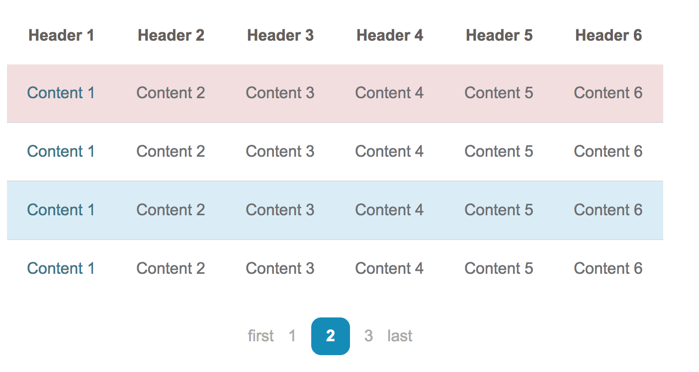

# Exercise 17

- Create a index17.html file
- Copy and paste the following HTML code:

## index17.html

```html
<!DOCTYPE html>
<html>
  <head>
    <title>Learning CSS</title>
  </head>
  <body>
    <table>
      <thead>
        <tr>
          <th>Header 1</th>
          <th>Header 2</th>
          <th>Header 3</th>
          <th>Header 4</th>
          <th>Header 5</th>
          <th>Header 6</th>
        </tr>
      </thead>
      <tbody>
        <tr class="error">
          <td>Content 1</td>
          <td>Content 2</td>
          <td>Content 3</td>
          <td>Content 4</td>
          <td>Content 5</td>
          <td>Content 6</td>
        </tr>
        <tr>
          <td>Content 1</td>
          <td>Content 2</td>
          <td>Content 3</td>
          <td>Content 4</td>
          <td>Content 5</td>
          <td>Content 6</td>
        </tr>
        <tr class="selected">
          <td>Content 1</td>
          <td>Content 2</td>
          <td>Content 3</td>
          <td>Content 4</td>
          <td>Content 5</td>
          <td>Content 6</td>
        </tr>
        <tr>
          <td>Content 1</td>
          <td>Content 2</td>
          <td>Content 3</td>
          <td>Content 4</td>
          <td>Content 5</td>
          <td>Content 6</td>
        </tr>
      </tbody>
      <tfoot>
        <tr>
          <td colspan="6">
            <a href="#">first</a>
            <a href="#">1</a>
            <a href="#" class="active">2</a>
            <a href="#">3</a>
            <a href="#">last</a>
          </td>
        </tr>
      </tfoot>
    </table>
  </body>
</html>
```

- After applying all styles the document must look like this:



## Part A

- Add a style element
- Select the table element and apply the following style:
  - Borders must be collapse
  - Use Arial, Helvetica, sans-serif as font family
  - Text color must be #6e6f74
- Select the thead element and apply the following style:
  - Text color must be #685e5c
  - Font weight must be bold
- Select the tr elements that are children of the tbody element and apply the following style:
  - Use this value: `1px solid #ddd` only for border bottom
- Select the th and td elements and apply the following style:
  - Add 20px padding to all sides
- Select the first td child element (first-child pseudoclass) from the tbody element and apply the following style:
  - Text color must be #3e7589
- Select the last tr child element (last-child pseudoclass) from the tbody element and apply the following style:
  - Remove all borders
- Select the tfoot element and apply the following style:
  - Text align must be center
- Select the link elements that are children of the tfoot element and apply the following style:
  - Display must be inline-block
  - Remove text decoration
  - Text color must be #aaa
  - Add 10px only to right margin
- Select the link element with the active class that is children of the tfoot element and apply the following style:
  - Text color must be white
  - Font weight must be bold
  - Background color must be #008cba
  - Add 10px padding to top and bottom sides
  - Add 15px padding to left and right side
  - Add a border radius of 10px
- Select the element with the selected class and apply the following styles:
  - Background color must be #d9edf6
- Select the element with the error class and apply the following styles:
  - Background color must be #f2dedf

## Part B

- Now create your own HTML table
- Open [Trendy web color palettes and material design color schemes tools](https://www.awwwards.com/trendy-web-color-palettes-and-material-design-color-schemes-tools.html)
- Select a color palette that you like
- Style your new table using the colors you choose
