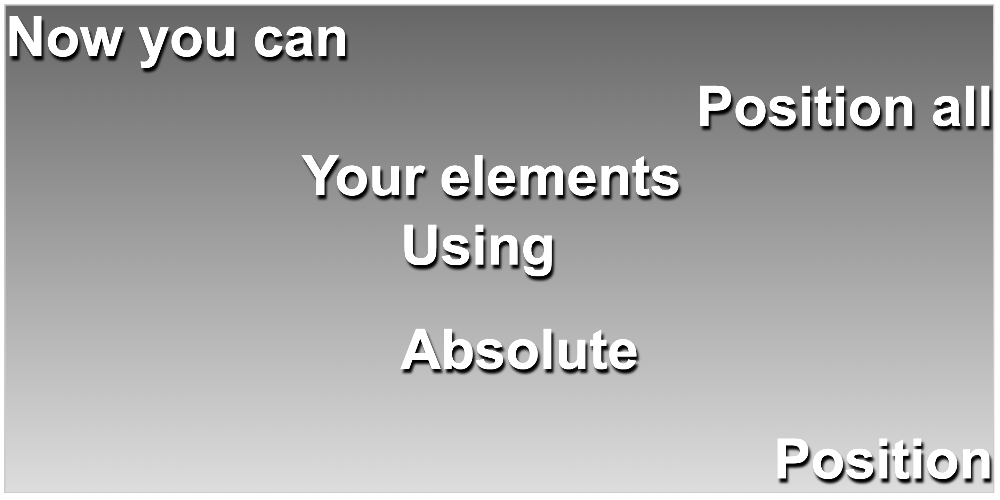

# Exercise 21

- Create a index21.html file
- Copy and paste the following HTML code:

## index21.html

```html
<!DOCTYPE html>
<html>
  <head>
    <title>Learing CSS</title>
  </head>
  <body>
    <div class="container">
      <div class="one">Position</div>
      <div class="two">Absolute</div>
      <div class="three">Using</div>
      <div class="four">Your elements</div>
      <div class="five">Position all</div>
      <div class="six">Now you can</div>
    </div>
  </body>
</html>
```

- After applying all styles the document must look like this:



- Add a style element
- Select the container class element and apply the following style:
  - Position must be relative
  - Background must be linear-gradient(180deg, #666, #ddd)
  - Add a 2px solid #ccc border to all sides
  - Make the element 700px tall
- Select the div element that are children of the container class element and apply the following style:
  - Position must be absolute
  - Use Arial, Helvetica, sans-serif as font family
  - Font color must be white
  - Font size must be 80px
  - Make the font bold
  - Add text shadow using the following value 3px 6px 5px #000
- Select the one class elements and apply the following style:
  - Bottom must be 0
  - Right must be 0
- Select the two class elements and apply the following style:
  - Top must be 450px
  - Left must be 40%
- Select the three class elements and apply the following style:
  - Top must be 300px
  - Left must be 40%
- Select the four class elements and apply the following style:
  - Top must be 200px
  - Left must be 30%
- Select the five class elements and apply the following style:
  - Top must be 100px
  - Right must be 0
- Select the six class elements and apply the following style:
  - Top must be 0
  - Left must be 0
- Change the values for each one to six class elements, try left, top, bottom and right

### Extra

- Now try adding some color using the :hover pseudo class and the elements that you have already selected

```css
.container:hover {
  background: linear-gradient(180deg, #ddd, #666);
}

.six:hover {
  color: pink;
}
```
