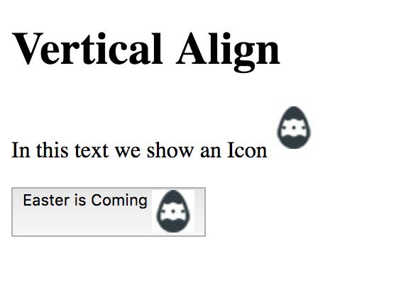
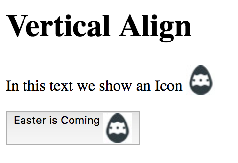
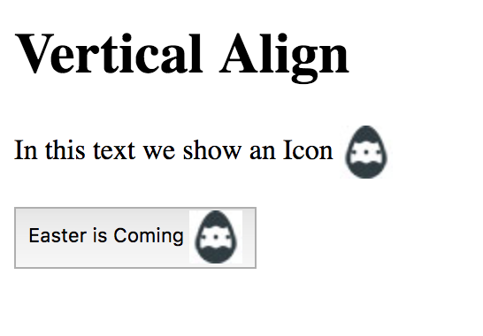

# Exercise 7

- Create a folder with the name ex_7
- Create a index.html file inside the ex_7 folder
- Download the following [icon](../../resources/images/css/easter-egg.jpg) and copy it to the ex_7 folder

```
/ex_7
|
|- index.html
|- image.png

```

- Copy and paste the following HTML code:

## index.html

```html
<!DOCTYPE html>
<html>
  <head>
    <title>Vertical Align</title>
  </head>
  <body>
    <h1>Vertical Align</h1>
    <p>
      In this text we show an Icon
      
    </p>
    <button>
      Easter is Coming 
    </button>
  </body>
</html>
```

- After applying all styles the document must look like this:







- Add a style element
- Select the image element inside the paragraph and set the following style:
  - The image must be vertical align with the value super
- Now select the image element inside the button and set the following style:
  - The image must be vertical align with the value top
- Change the image element vertical align value to bottom, then middle and on each change refresh the page to see how vertical aligment works in CSS
- Happy Coding!
